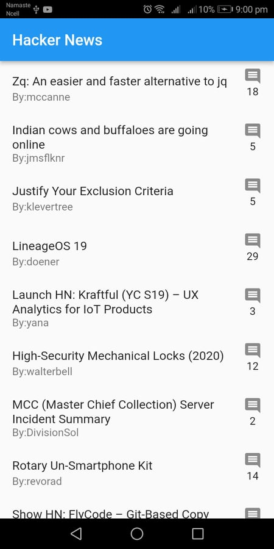
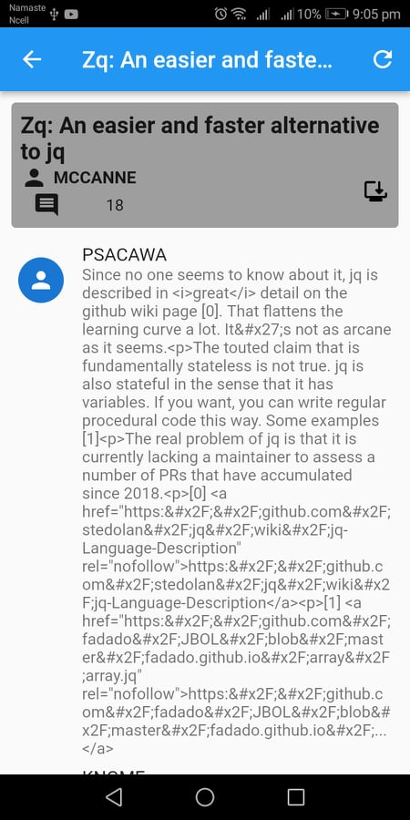

# HackerNews

Hacker News App in Flutter.

## Build with

- Api:

  - [API](https://github.com/HackerNews/API)

- Architecture:

  - [MVP](https://en.wikipedia.org/wiki/Model%E2%80%93view%E2%80%93presenter)

- State Management:

  - [Riverpod](https://riverpod.dev)

- Network:
  - [Dio](https://github.com/flutterchina/dio)
- UI:
  - [webview_flutter](https://pub.dev/packages/webview_flutter)
